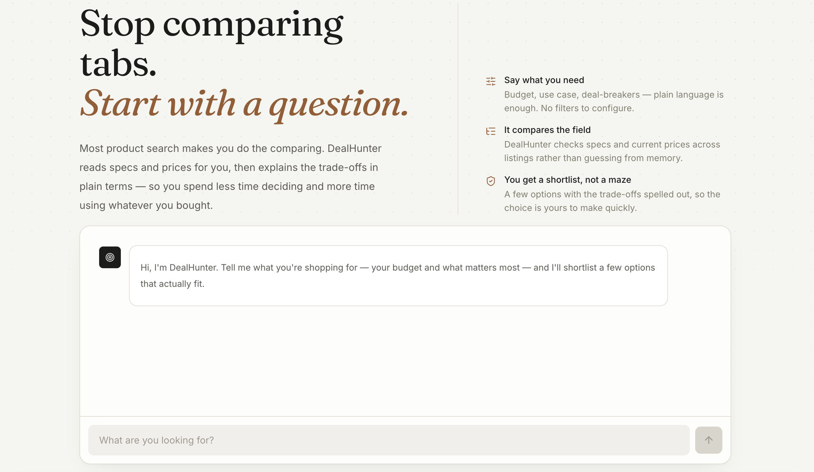

# DealHunter AI

DealHunter AI is an agentic e-commerce assistant that understands natural-language shopping requests, searches a product catalog, compares matching products, and generates personalized recommendations.

The project combines **LLMs, MCP (Model Context Protocol), FastAPI, and Next.js** to demonstrate a practical agentic AI workflow.



---

## Overview

Instead of manually filtering and comparing products, users can describe what they need in natural language.

Example:

> I need a laptop under ₹70,000 with at least 16GB RAM for programming. I care about battery life.

DealHunter AI:

1. Extracts the user's requirements.
2. Searches the product catalog through an MCP tool.
3. Compares matching products.
4. Considers user preferences.
5. Generates a recommendation.
6. Returns the result through a web interface.

---

## Architecture

```text
                    User
                     │
                     ▼
              Next.js Frontend
                     │
                     ▼
              FastAPI REST API
                     │
                     ▼
              DealHunter Agent
                     │
          ┌──────────┴──────────┐
          │                     │
          ▼                     ▼
     Qwen2.5 / Ollama       MCP Client
                                │
                                ▼
                         MCP Server
                                │
              ┌─────────────────┼─────────────────┐
              │                 │                 │
              ▼                 ▼                 ▼
       search_products   compare_products   get_product_details
              │                 │                 │
              └─────────────────┼─────────────────┘
                                │
                                ▼
                         Product Catalog
```

---

## Agent Workflow

```text
User Request
     │
     ▼
Requirement Extraction
     │
     ▼
MCP Product Search
     │
     ▼
Matching Products
     │
     ▼
MCP Product Comparison
     │
     ▼
LLM Analysis
     │
     ▼
Personalized Recommendation
```

The system separates deterministic product operations from LLM reasoning.

Product data is retrieved through MCP tools, while the LLM handles requirement understanding, analysis, and recommendation generation.

---

## Features

- Natural-language product search
- AI-powered requirement extraction
- MCP-based product tools
- Budget and specification filtering
- Product comparison
- Personalized recommendations
- User preference support
- Local LLM inference with Ollama
- FastAPI backend
- Next.js frontend
- Responsive chat interface
- Swagger API documentation

---

## MCP Tools

### `search_products`

Searches the product catalog using requirements such as:

- Maximum price
- Minimum RAM

Example:

```json
{
  "max_price": 70000,
  "min_ram": 16
}
```

### `compare_products`

Compares multiple products using their IDs.

Example:

```json
{
  "product_ids": [1, 2, 3, 4]
}
```

### `get_product_details`

Retrieves complete information about a specific product.

Example:

```json
{
  "product_id": 2
}
```

---

## Tech Stack

### AI

- Python
- Qwen2.5 3B
- Ollama
- LangChain
- Model Context Protocol

### Backend

- FastAPI
- Uvicorn
- Pydantic

### Frontend

- Next.js
- React
- TypeScript
- Tailwind CSS
- Lucide React
- React Markdown

### Data

- JSON product catalog
- JSON user preferences

---

## Project Structure

```text
dealhunter-ai/
│
├── backend/
│   ├── app/
│   │   ├── __init__.py
│   │   ├── main.py
│   │   └── api.py
│   │
│   └── data/
│       ├── products.json
│       └── preferences.json
│
├── mcp_server/
│   └── server.py
│
├── frontend/
│   ├── app/
│   ├── public/
│   ├── package.json
│   └── ...
│
├── .gitignore
└── README.md
```

---

## Requirements

Make sure you have:

- Python 3.11+
- Node.js 18+
- Ollama
- Git

Pull the Qwen model:

```bash
ollama pull qwen2.5:3b
```

---

## Backend Setup

Navigate to the backend:

```bash
cd backend
```

Create a virtual environment:

```bash
python3 -m venv venv
```

Activate it:

```bash
source venv/bin/activate
```

Install dependencies:

```bash
pip install -r requirements.txt
```

If `requirements.txt` has not been created yet:

```bash
pip install fastapi uvicorn langchain langchain-ollama mcp langchain-mcp-adapters
```

---

## Run the Backend

From the `backend` directory:

```bash
uvicorn app.api:app --reload
```

The API will be available at:

```text
http://127.0.0.1:8000
```

Swagger documentation:

```text
http://127.0.0.1:8000/docs
```

---

## Frontend Setup

Open another terminal and navigate to the frontend:

```bash
cd frontend
```

Install dependencies:

```bash
npm install
```

Start the development server:

```bash
npm run dev
```

The frontend will be available at:

```text
http://localhost:3000
```

---

## API

### Health Check

```http
GET /health
```

Response:

```json
{
  "status": "healthy"
}
```

### Chat

```http
POST /api/chat
```

Request:

```json
{
  "message": "I need a laptop under ₹70000 with at least 16GB RAM for programming."
}
```

Response:

```json
{
  "response": "Based on your requirements..."
}
```

---

## Example

### User Request

```text
I need a laptop under ₹70000 with at least 16GB RAM for programming.
I care about battery life.
```

### Agent Process

```text
Requirement Extraction
        ↓
Budget: ₹70,000
RAM: 16GB
Category: Laptop
        ↓
MCP Search
        ↓
4 Matching Products
        ↓
MCP Comparison
        ↓
LLM Analysis
        ↓
Personalized Recommendation
```

The recommendation considers:

- Price
- RAM
- Processor
- Storage
- Battery life
- Rating
- Reviews
- User preferences

---

## Why MCP?

MCP provides a standardized interface between the AI agent and external capabilities.

Instead of directly embedding every product operation into the LLM, DealHunter exposes product operations as MCP tools.

```text
LLM Agent
    │
    ▼
MCP Client
    │
    ▼
MCP Server
    │
    ├── Search Products
    ├── Compare Products
    └── Get Product Details
```

This makes the system easier to extend with additional tools and external data sources.

---

## Design Approach

The project intentionally keeps the architecture lightweight.

Deterministic operations such as product filtering and comparison are handled by application logic and MCP tools.

The LLM is responsible for:

- Understanding natural-language requirements
- Interpreting user priorities
- Analyzing product information
- Generating recommendations

This approach reduces unnecessary LLM tool-calling loops while keeping the system predictable and practical.

---

## Future Improvements

- Real e-commerce APIs
- Product images and external product links
- Real-time price tracking
- Product availability tracking
- Web search integration
- Persistent user profiles
- PostgreSQL product storage
- Streaming AI responses
- Recommendation history
- Docker deployment
- Cloud deployment

---

## License

This project is built for educational purposes.